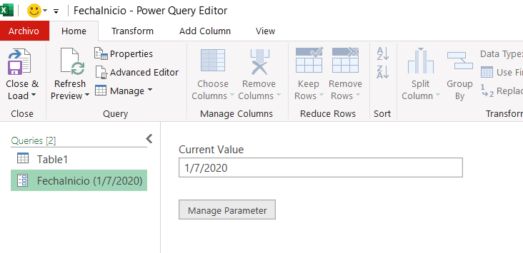
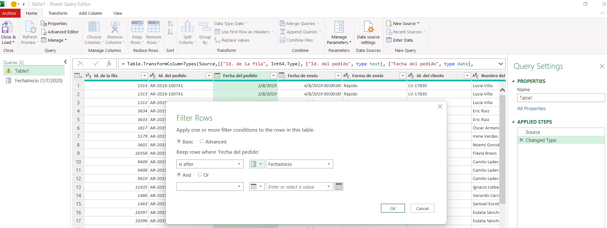
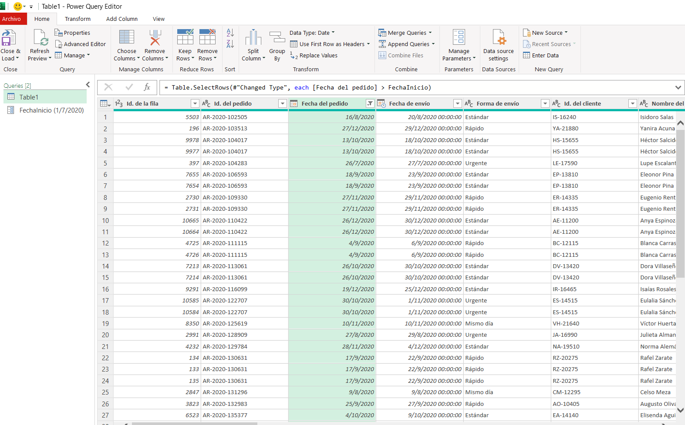
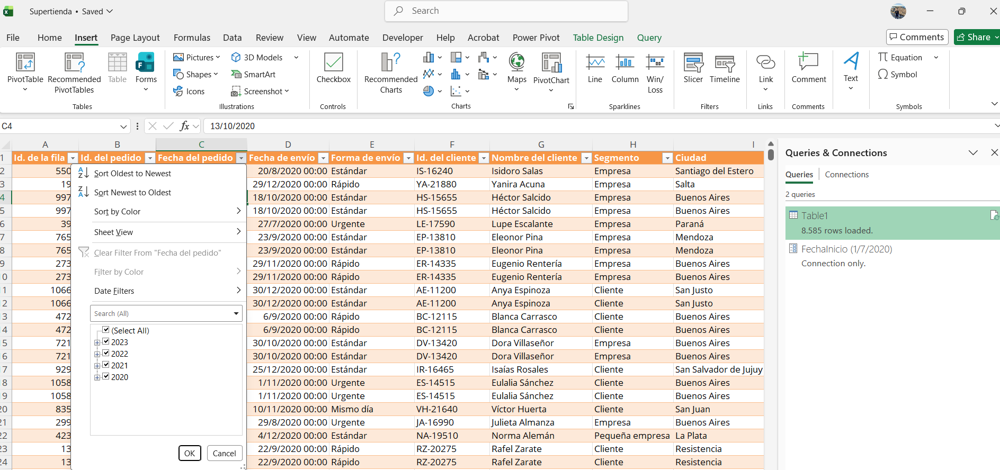

# Automatizando filtros de fechas en Power Query mediante parámetros dinámicos

> ## TL;DR
>
> Se implementó un filtro dinámico utilizando parámetros en Power Query para evitar modificar manualmente las fechas en cada consulta. El proceso permitió mejorar la reutilización de la solución, reducir errores manuales y documentar el aprendizaje mediante un enfoque de post-mortem constructivo y control de versiones con Git.

---

# Contexto

Durante una práctica de análisis de datos en Power Query debía automatizar el filtrado de registros de ventas según un rango de fechas. El objetivo era evitar modificar manualmente los filtros cada vez que cambiaba el período de análisis, permitiendo reutilizar la consulta de forma más eficiente.

---

# Problema

Inicialmente el filtrado se realizaba ingresando una fecha fija en la consulta. Aunque el resultado era correcto para un período específico, cada nuevo análisis requería modificar nuevamente el filtro, haciendo el proceso repetitivo y aumentando la posibilidad de cometer errores.

Además, no conocía cómo utilizar parámetros en Power Query para realizar un filtrado dinámico.

---

# Acciones realizadas

Para resolver el problema seguí el siguiente proceso.

## 1. Creación del parámetro

Primero creé un parámetro llamado **FechaInicio**, definiendo su tipo de dato como **Fecha** y asignando un valor inicial.



---

## 2. Aplicación del filtro dinámico

Posteriormente reemplacé el valor fijo del filtro por el parámetro **FechaInicio**, permitiendo que la consulta utilizara automáticamente el valor definido en el parámetro.



---

## 3. Validación de la consulta

Después de aplicar el filtro comprobé que únicamente se mostraran los registros cuya fecha fuera igual o posterior al valor establecido en el parámetro.



---

## 4. Resultado final en Excel

Finalmente cargué nuevamente la consulta en Excel para verificar que los datos filtrados se actualizaran correctamente.



---

# Post-Mortem Constructivo

## ¿Qué ocurrió?

El principal inconveniente fue el desconocimiento del uso de parámetros dentro de Power Query. Inicialmente la solución dependía de modificar manualmente el filtro cada vez que cambiaba el período de análisis.

## Causa raíz

La falta de experiencia con parámetros provocó que la primera solución fuera poco reutilizable y difícil de mantener.

## Acciones correctivas

- Investigar la funcionalidad de parámetros.
- Reemplazar valores fijos por parámetros dinámicos.
- Validar los resultados con diferentes fechas.
- Documentar todo el procedimiento.

## Prevención

En futuros proyectos:

- Revisaré primero la documentación oficial.
- Implementaré parámetros cuando existan valores que cambien con frecuencia.
- Documentaré los pasos antes de finalizar el desarrollo.
- Registraré los cambios utilizando Git.

---

# Aprendizajes

Esta actividad reforzó varios conceptos importantes:

- Los parámetros permiten construir consultas reutilizables.
- La documentación facilita el mantenimiento del trabajo.
- Un error puede convertirse en una oportunidad de aprendizaje cuando se analiza de forma objetiva.
- Registrar cambios mediante Git mejora la trazabilidad del proyecto.

---

# Evidencia de Control de Versiones

Este proyecto utiliza Git y GitHub para registrar la evolución del trabajo.

Una vez realizados los commits, aquí se incluirá una captura del historial de cambios.

> **Imagen pendiente**

```markdown

```

---

# Reflexión sobre Feedback Radicalmente Sincero

Durante el desarrollo del ejercicio mantuve una actitud abierta a recibir observaciones sobre la documentación y la forma de presentar la solución. Las sugerencias recibidas permitieron reorganizar el contenido, mejorar la claridad de las explicaciones y utilizar un lenguaje más simple tanto para perfiles técnicos como para personas sin experiencia en Power Query.

Este proceso confirmó que el feedback constructivo no busca señalar errores personales, sino mejorar el resultado final y favorecer el aprendizaje continuo.

---

# Conclusión

La implementación de parámetros dinámicos permitió automatizar el proceso de filtrado de fechas en Power Query, eliminando la necesidad de modificar manualmente la consulta en cada ejecución.

Además del aprendizaje técnico, esta actividad permitió aplicar conceptos de mentalidad de crecimiento, documentación estructurada, post-mortem constructivo y control de versiones con Git. Estas prácticas favorecen la mejora continua y facilitan la colaboración en entornos de trabajo.